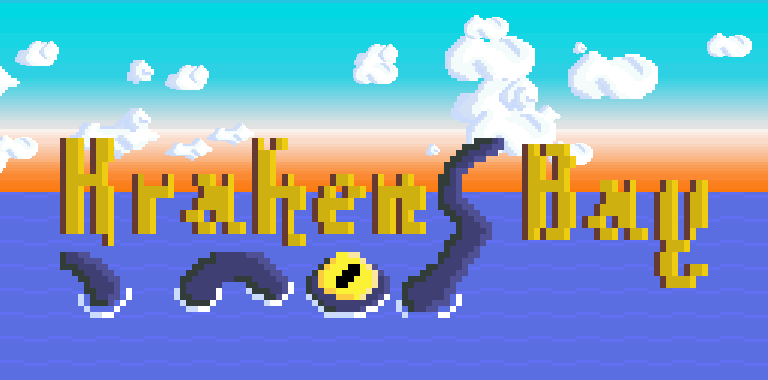

    

This is game made in 48 hours, as an entry the 7th Alakajam competition. It is coded in a homemade script language **Way** (the interpreter is in Java).

https://alakajam.com/7th-alakajam/787/kraken-bay

---

## Requirements

- Java 8

## Installation

- Launch **build** script file (.bat/.sh)
- Go to the newly created folder **build/**
- Launch **run** script file (.bat/.sh)
